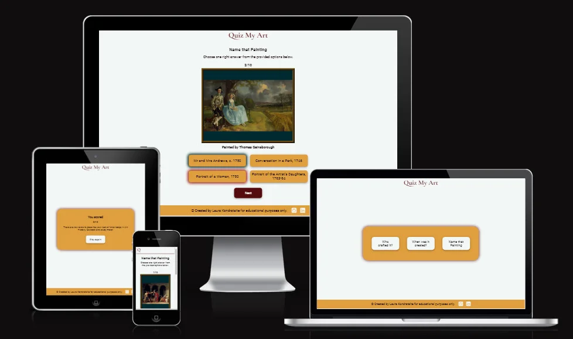

# Quiz My Art 

(By Laura Kondrataite)

Quiz My Art is an interactive quiz website that tests the user's art history knowledge. It is an image-based quiz which provides a more engaging and visual appeal to the user.

The user will choose from three different categories, and answer image-based questions based on different question/task prompts. After completing the quiz, they will be taken to a final page screen which will show their total score. 

Quiz My Art game is created for educational purposes only as part of Code Institute's Web Development Diploma course for JavaScript portfolio project.

Link to live page: [Quiz My Art](https://laurakond.github.io/quiz-my-art/)

## Table of Contents

[Design](#design)
- [Target audience](#target-audience)
- [User Stories](#user-stories)
- [Website Structure](#website-structure)
- [Wireframes](#wireframes)
- [Color palette](#color-palette)
- [Font styles](#font-styles)

[Features](#features)
- [Existing features](#existing-features)
- [Features Left to Implement](#features-left-to-implement)

[Tools and Technologies](#tools-and-technologies)
- [Languages used](#languages-used)
- [Frameworks, Libraries and Programs used](#frameworks-libraries-and-programs-used)

[Deployment](#deployment)
- [Local Development](#local-development)
	- [How to Fork](#how-to-fork)
	- [How to Clone](#how-to-clone)

[Testing](#testing)  

[Credits](#credits)
- [Content](#content)
- [Used Code](#used-code)
- [Media](#media)
- [General resources](#general-resources)
- [Acknowledgments](#acknowledgments)
- [References](#references)

## Design

### Target audience

This quiz game is aimed towards anyone who enjoys participating in quiz games, wants to learn something new and enjoys their time answering questions to varying degrees of difficulty:

- People who are interested in and like art, art history and history.
- People who want to test their art history knowledge.
- People who would like to learn something new while taking part in an interactive quiz game.
- People who are interested in quizzes and trivia games.

### User Stories

**As a first time user, I want to:**
- Clearly understand how the quiz works and what it is about. 
- Be able to read instructions before the start of the quiz.
- Be able to start the quiz when I am ready.

**As a user I want to:**
- Test my art history knowledge by completing a quiz.
- Choose a category or difficulty of the quiz.
- Have multiple choice questions to pick from.
- See how many questions there are in total per round and which question I am at.
- Instantly see if my choice was correct.
- Find out my final score.
- Be able to take the quiz again after the completion.
- Have a variety of questions that do not repeat.
- Challenge myself by answering the questions without multiple choice options.

### Website Structure

The website follows a one-page structure with multiple sections that are accessible by applying JavaScript functionality. Upon loading the screen, the user is taken to a Home or landing page that offers three different categories to choose from. The page shows and, or hides specific sections dependent on button prompts.

### Wireframes
The following wireframe mockups show the initial idea of how the website would look on three different devices: mobile, tablet/iPad and laptop/desktops. They also convey an idea of how the user will navigate between different sections of the page which are prompted using JavaScript.

The final version bears slight differences to the wireframes:
- One of the categories was initially planned to be text based. However, upon further reflection, I decided to have three image categories in order to provide consistency to the quiz. The topic of the category was adapted to focus on art movements and periods instead of the time when the artists lived.
- I decided to adjust the logo of the website to display one letter "Q" on smaller devices such as smaller mobile phones. This feature is visible inside each category upon selection of the quiz theme (shown in the features section below).
- I decided to keep the header displaying the main Logo throughout the game.
- I decided to include a "next button" below the answer choice buttons.
- The Bonus round was not implemented due to time constraints and was moved to the future development stage.
- I changed the display of the landing page for the tablet and desktop screens.

#### Mobile 

**Landing page**

**Each quiz category page**:

**Score page**

**404 page**

#### Tablet

**Landing page**

**Quiz category**

  
#### Laptop/Desktop

**Landing page**

**Quiz category**

### Color palette

The following palette was used to ensure contrast is achieved between the main parts of the website:

- #F3F7F5 - Seasalt - for main background, header color, default inner button color for "categories" buttons, "Play again" button, and "Return to Home page" button on error page. It was also used as a button font for the hover effect on larger devices.
- #100007 - Licorice - for all fonts excluding the Logo.
	- rgba color hex (16, 0, 7) of Licorice was used for the button shadow effect to make them pop.
- #002A32 - Gunmetal - for the backdrop of the image container, and for the correct button shadow effect.
- #7B5214 - Field drab - for the image container ridge border.
- #E09F3E - Hunyandi yellow - for the footer, main categories' container, answer choice buttons, score section container, and error page message container.
- #9E2A2B - Auburn - for the box shadow effect around the above-mentioned container areas, the header shadow for smaller devices, and for the incorrect button shadow effect.
- #540B0E - Chocolate cosmos - for the font color of the Logo and as a button background color for hover effect on larger devices.

### Font styles

I used [Google fonts](https://fonts.google.com/) to source fonts for the website. These are:

- Cormorant Garamond, serif by [Christian Thalmann](https://fonts.google.com/?query=Christian%20Thalmann)- was used as the Logo font.
- Roboto, sans-serif by [Christian Robertson](https://fonts.google.com/?query=Christian%20Robertson) - was used as the main content font.
 
 [Return to Table of Contents](#table-of-contents)

## Features

The website offers three themes/topics to choose from:
- Name the artist
- Name the art movement or period
- Name the painting

There is also a Score page section that is visible upon completion of the game, and a 404 Error page, which is only visible when a wrong website address is entered or an error occurs.

All features are fully responsive on mobiles, tablets/iPads, laptops and desktops. 

### Existing features

**The Header**

- Featured in all pages, the header is fully responsive and displays the website's logo. Once inside the quiz, it transitions into a shortened version displaying the letter "Q" so as to not occupy the entire space.
	- This feature is only available on the smallest phones up to 375px (the latter not included).
- The header allows the user to return to the Home page by clicking the Logo or the letter "Q".
- A header border shadow is applied once the user is inside each quiz category, and reverts back to regular display when on the score page. 
	- This feature is only availabe on devices up to 675px (the latter not included).

 

**The Footer**

- Featured throughout, the footer displays the name of the creator. Once on a larger screen, it expands to show a disclosure that the project is created for educational purposes only as part of the Code Institute's Web Development programme. 
- It also contains links to the developer's social media sites. Both links open in a new tab to allow easy navigation for the user.

 

**The Home page**

- The Home page displays three different quiz categories that the user can choose from. They are placed in a container to capture the user's attention. These categories are:

- "Who crafted it?"
- "When was it created?"
- "Name that painting"

The names of the categories are simple and allow the user to identify the topic of the quiz straight away.

   

**Three Quiz Categories** 

**Category title and instructions**
- Once inside each category quiz, the category/quiz name is shown at the top of the page, clearly indicating which question the user has chosen to play. 

- Just under it, I have included a brief sentence explaining how to play the quiz. 

    - I have deliberately chosen to include these instructions inside each category, as the nature of the quiz is intuitive. The instruction reinforces the understanding on how a multiple-choice quiz works. 

    - This also allows the user to go back to the instructions at any given time and remind themselves if needed.

    - I felt that there was no need to have a separate page created for what could be shown in the main area of the quiz.

 

**Question count**

- A question count is displayed just above the image of the artwork which allows the user to follow their progress and know which question prompt they are at.

 

**Question images**

- Each quiz displays ten randomly chosen images from three different lists containing twenty questions each. This prevents question repetition in case the user chooses to play the same category straight away.- Below the displayed question image, the user will find more information referring to the shown image. This might be the title of the artwork, an artist's name or an artist's name with the artwork's title and date depending on the category that is selected.

 

**Four answer options**

- The four answer options below the image and the prompt are generated using JavaScript, and allow the user to select only one answer. 
- Upon selection of the answer, the game will automatically accept it as a final answer and will block the user from changing their answer choice.- The button will display a green border shadow effect around it if the answer is correct, and a red border shadow if the chosen answer is incorrect. If the user's guess was incorrect, the correct answer will be highlighted, allowing for the user to find out what it was.

 

**The Next Button** 
- The Next button is hidden until the answer is selected, and it is displayed below the answer buttons and above the footer at the bottom of the screen. Once clicked, it will take the user to the next question and hide again until the next answer is selected.
- It is displayed in a different color from the rest of the buttons in order to attract attention and indicate the next step after the answer-choice button is clicked.   

  

 

**The Score Page** 
- The Score section is prompted once the user has finished answering the questions. It will display a total score of correct answers and will give a text prompt depending on the score count. 
    - I chose to exclude the display of the score count as the user progresses, as it would have distracted from the quiz. This way, the user is likely to progress to the end of the quiz to find out their total score at the end.  
    - I chose to include the text prompt based on the score count in order to customise the interaction and user experience. This will engage the user more and will encourage them to retake the quiz if the score was lower than the maximum. 
    - There are four possible score outcomes: 
        - 10 out of 10
        - 6 - 9
        - 4 - 5
        - Lower than 4

  

**Play Again Button**
- The Play Again button is displayed in the Score section and will take the user back to the main page once clicked.

 

**404 Error page** 
- An error page has been included in case there are any bugs that prevent the website or links from working properly. 
- The page has an anchor tag that has been styled to look like a button to indicate intended action. Upon clicking it, the link will take the user back to the Home page of the website. It also displays a feature image that was used as a Fav Icon to allow design continuity. 

  

 

### Features Left to Implement

- The Quiz category, which allows the user to test their knowledge by entering a full artist name, title of the artwork and the date.  

    - The functionality will be created using JavaScript by comparing the right answers with the user's input.

- A link to external sources that allows the users to read about each artist/work of art if they wish to do so. 

    - This would be provided either as a separate section on the Total score page or a completely separate page itself.

- Redesign the current Home page for the desktop to make it into three separate containers of their own.

[Return to Table of Contents](#table-of-contents)

### Accessibility

  - I have followed good standard accessibility practices by including the following:
	  - I used semantic HTML.
	  - I included descriptive atl attributes to used images. 
	  - I marked the current page with the "current" attribute to ensure that screen readers indicate it to the users.
	  - I provided descriptive information for the screen readers where icons were used.
	  - I ensured that sufficient color contrast is provided when choosing the color palette.    

 [Return to Table of Contents](#table-of-contents)

## Tools and Technologies

### Languages used

- HTML, CSS and JavaScript languages were used for creating this website.
- Markdown language was used for creating the README file.

### Frameworks, Libraries and Programs used

The following resources were used to help implement the website:
- [Basamiq](https://balsamiq.com/) for creating wireframes
- [GitHub](https://github.com/) for creating and storing files and folders of the website
- Git was used for version control
- VScode editor for writing the code
- [Font Awesome](https://fontawesome.com/) for providing iconography for the website
- [Google Fonts](https://fonts.google.com/) for choosing appropriate fonts
- [Favicon](https://favicon.io/) for generating a favicon
- Google Chrome DevTools for testing, troubleshooting and brainstorming code solutions
- [Am I Responsive?](https://ui.dev/amiresponsive) website for showing the website's responsiveness on different devices
- [Responsive Design Checker](https://responsivedesignchecker.com/) website for checking responsiveness on different devices
- [Pixelied](https://pixelied.com/), [ILoveIMG](https://www.iloveimg.com/), Gimp, for resizing, compressing and editing images
- [Coolors](https://coolors.co/) for generating the color palette
- WCAG color contrast checker for website accessibilty
- Wave evaluation tool for giving visual feedback about the accessibility of the website
- [Contrast Grid](https://contrast-grid.eightshapes.com/) to test chosen color palette

 [Return to Table of Contents](#table-of-contents)

## Deployment

This website was deployed using GitHub pages. To deploy the project, follow the steps below:
1. Login to GitHub and navigate to the main repository page.
2.  Click on the chosen repository [quiz-my-art](https://github.com/laurakond/quiz-my-art).
3. Once inside the repository, click on the "Settings" tab above the repository title displayed around the middle of the page.
4. Select "Pages" tab on the left side navigation menu.
5. In the "Source" section (middle of the screen), select "main" or "master" branch, then "root" folder and click "save" button.
6. The GitHub page site will be deployed.

It might take a few minutes to generate the "live" website link.

The live link to Quiz My Art can be found here: [Quiz My Art](https://laurakond.github.io/quiz-my-art/).  

### Local Development

#### How to Fork
To fork the repository:
1. Follow steps 1 & 2 as above. 
2. Once inside the chosen repository, click the "fork" button in the top right corner above the "About section".

#### How to Clone
To clone the repository:
1.  Follow steps 1 & 2 as in the deployment section above.
2.  Click on the "Code" button (often a bright color that stands out) in the top right corner just above the "commits" history. 
    - Select whether you would like to clone with HTTPS, SSH or GitHub CLI and copy the link shown.
3.  Open the terminal in your chosen code editor and change the current working directory to the location you want to use for the cloned directory.
4.  Type 'git clone' into the terminal and then paste the copied link and press enter.

[Return to Table of Contents](#table-of-contents)

## Testing 

The website has been tested on Mozilla Firefox desktop, Internet Explorer desktop, Safari mobile, Google Chrome desktop and mobile, Samsung Galaxy Tab 8, and Google Chrome Dev.

See [TESTING.md](https://stackedit.io/app#testing) for full testing and validation information.

[Return to Table of Contents](#table-of-contents)

## Credits

This project has proven to be a challenge, which required additional study and research time in order to become knowledgeable about the topic. Therefore, I have used a plethora of resources in order to understand the language. The following resources I have referred to in preparation for and while creating the Quiz My Art website:

The main inspiration and an idea for a template came from the video below:
- [Web Dev Simplified](https://www.youtube.com/watch?v=riDzcEQbX6k)

Additional insight and ideas were gathered from the following videos:
- [GreatStack](https://www.youtube.com/watch?v=PBcqGxrr9g8)
- [How to Become a Developer](https://www.youtube.com/watch?v=MgeQa7qXIwI)
- [James Q Quick](https://www.youtube.com/watch?v=rFWbAj40JrQ&list=PLDlWc9AfQBfZIkdVaOQXi1tizJeNJipEx&index=5)

I have also referred to the Code Institute's Love Maths walkthrough project as a baseline for understanding and implementing some parts of the code. These are noted in the JavaScript code.

### Content

All the content, i.e. the questions, score descriptions and other (excluding the names of the artists, artworks' titles), was produced by me.  

### Used code
- I used the following code to implement a circle styling the error page image. The link to the code can be found [here](https://developer.mozilla.org/en-US/docs/Web/CSS/basic-shape/circle): `clip-path: circle(50px);`
- I used the following code to apply the box shadow effect to all the buttons in my project:
`box-shadow: rgba(0, 0, 0, .2) 0  3px  5px  -1px, rgba(0, 0, 0, .14) 0  6px  10px  0, rgba(0, 0, 0, .12) 0  1px  18px  0;`

    - The style used was Google button 17. The link to the website is [here](https://getcssscan.com/css-buttons-examples). 
    - **To note:** I have appropriated this code and used #100007 - Licorice in rgba color code in order to keep the shadow color within the chosen project palette.
- Some of the code applied to general styles for CSS was taken from my PP1 project. This is noted by comments in the CSS file. 
- The 404-page template was taken from my Cross Stitch Art portfolio project and was adjusted accordingly to fit the brief of this project.

### Media

#### Images

- All images were sourced from [wikipedia.org](https://www.wikipedia.org/) website.
- A few images, i.e. Frida Kahlo, Mark Rothlo, and Roy Lichtenstein, are of lower quality. In order to obtain higher resolution images, I would have needed to get in touch with the respective museums and art galleries for copyright reasons. Due to the time constraint of this project, I have decided to use the images I was able to source. 

### General resources

### Acknowledgments

My thanks goes to my mentor, [Martina Terlevic](https://github.com/SephTheOverwitch), for providing guidance, and support on all things code and project.

A big shout-out to [Vernell Clark](https://github.com/VCGithubCode) for his increadible patience, support and guidance on how to work with JavaScript.

Also a bit thanks goes to [Jamie Connell](https://github.com/GreenNinjaBoy) for helping out with sticky bits when creating the game.

A big thank you goes to the Code Institute Tutor support & Slack community who provided the energy and kept my morale up.

### Code inspiration

 

 [Return to Table of Contents](#table-of-contents)