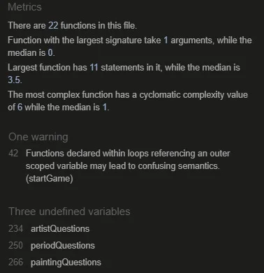

# Testing readme for "Quiz My Art" project
(By Laura Kondrataite)

## Contents

[Testing](#testing)

- [W3C Validator testing](#w3c-validator-testing)
- [JS Hint testing](#js-hint-testing)
- [Bugs](#bugs)
	- [Website development and related issues](#website-development-and-related-issues)
	- [Fixed bugs](#fixed-bugs)
	- [Unfixed bugs](#unfixed-bugs)
- [Lighthouse](#lighthouse)
- [User stories testing](#user-stories-testing)
- [Accessibility](#accessibility)
- [Browser testing](#browser-testing)
- [Responsiveness testing](#responsiveness-testing)
- [User testing](#user-testing)
- [Manual testing](#manual-testing)

## Testing

### W3C Validator Testing

- All HTML pages and CSS files were tested with W3C Markup and CSS validation services. 

#### HTML

**Index.html page**
- Initial run of the index.html returned an error indicating that the img element, which is being generated using JavaScript, was missing correct src and alt attributes (image of the test lost). 
	- I resolved this by using a "#" as a placeholder for both src and alt attributes, and ensured that the alt attribute is being generated together with the image src attribute.
- The final run of the **index.html page** through the W3C validator returned no errors.
	- The screenshot of the final test run can be found [here](assets/documentation/testing-images/w3school/w3c-index.webp).

**404 page**
- The initial run of 404 error html page returned an error in the aria-current attribute for h1 element.
	- The screenshot of the test run with one displayed error can be found [here](assets/documentation/testing-images/w3school/w3c-404-with-error.webp).
	- I resolved this by adjusting the correct value to "page".
- The second error that was generated (image lost due to multiple corrections of the code) returned a semantic error indicating that a button element cannot be stored inside an anchor tag. 
	- I had several attempts to try and connect the button area to the main index.html file. At the end, I decided to keep the anchor tag and style it to look like a button. 
	- The screenshot of the final test run can be found [here](assets/documentation/testing-images/w3school/w3c-404-no-error.webp).

**CSS**
- No errors were found when passing through the official W3C CSS validator. The screenshot of the test result can be found [here](assets/documentation/testing-images/w3school/w3c-css.webp).

[Return to Table of Contents](#contents)

### JS Hint Testing

All JavaScript pages were tested with JsHint services. Initial tests of the code returned the following warnings:

1) A couple of minor warnings of missing semicolons, which I corrected in the code subsequently (screenshot not taken).
2) A warning about three undefined variables which I have removed from the code (screenshot not taken).    
3) Three warnings of undefined variables.
    - This was generated because I have chosen to create three additional JavaScript files each containing an appropriate question list, i.e. artistQuestions, periodQuestions, and paintingQuestions.
    - The final screenshot of JSHint test run for the main script code: 

4) The test run for each category file returned a warning of three unused variables: artistQuestions, periodQuestions and paintingQuestions. 
    - As mentioned at point 3, this is due to the fact that I chose to create three separate JavaScript files that house each category of questions. 
    - The test run of each JavaScript page can be found below:
        - [artistQuestions](assets/documentation/testing-images\jshint/artist-questions-jshint.webp)
        - [periodQuestions](assets/documentation/testing-images/jshint/artist-questions-jshint.webp)
        - [paintingQuestions](assets/documentation/testing-images/jshint/artist-questions-jshint.webp)

[Return to Table of Contents](#contents)

### Bugs

**Website development and related issues**
When I started working on the project, my priority was to ensure that the quiz was fully functional. Therefore, I started working on JavaScript with a skeleton structure and a very basic design applied to the website. Once I was happy with how the website was working and that it was responding to button clicks correctly, I then shifted my focus to making it responsive and finally applying a color palette. 

Because I have chosen to manipulate the website mainly through the use of Ids and with a few classes, this has proven a challenge when working with CSS as the Ids were overriding each other. I had to tweak html code in order to ensure that I achieved the required responsiveness of the website. I also realised that my applied code in CSS (due to its hierarchical functioning) was overriding some of the website functionality. Therefore, I had to find ways to solve this without going back and changing the JavaScript code. 

I had to target a lot of individual elements and sections to ensure that I achieved the required responsiveness and design, in part because a lot of elements were generated/manipulated by JavaScript code, and some of them were overriding or overridden other parts of the code. This has resulted in a lengthy CSS file, which I have condensed and refactored as much as possible before it started affecting the visual display/responsiveness and functionality of the website.  

Below are just a couple of examples of the elements and sections that I had to target individually (some specificities are covered in the Fixed and Unfixed Bugs sections):
- I had to target the .btn class within the answer button section specifically because the functionality of correct/incorrect answers (set with Javascript) had changed since I started applying the color palette.
- In media queries, I had to target buttons and elements that are using/sharing .btn class specifically when setting the font size on larger devices because they did not respond to the change set against generic elements.

### Lighthouse

#### The Home page

	- **Desktop test score:**

      

	- **Mobile test score:**
  
      

#### Blank page

  
	- **Desktop test score:**
	
      

	- **Mobile test score:**

      

#### Blank page

	- **Desktop test score:**

	    

	- **Mobile test score:**

	    

#### 404 page

  - **Desktop test score:**
  
    

  - **Mobile test score:**
    
    

 [Return to Table of Contents](#table-of-contents)

 
### Accessibility

  - I have followed good standard accessibility practices by including the following:
	  - I used semantic HTML.
	  - I included descriptive atl attributes to used images. 
	  - I marked the current page with the "current" attribute to ensure that screen readers indicate it to the users.
	  - I provided descriptive information for the screen readers where icons were used.
	  - I ensured that sufficient color contrast is provided when choosing the color palette.    

 [Return to Table of Contents](#table-of-contents)