# Testing readme for "Quiz My Art" project
(By Laura Kondrataite)

## Contents

[Testing](#testing)

- [W3C Validator testing](#w3c-validator-testing)
- [JS Hint testing](#js-hint-testing)
- [Bugs](#bugs)
	- [Fixed bugs](#fixed-bugs)
	- [Unfixed bugs](#unfixed-bugs)
- [Lighthouse](#lighthouse)
- [User stories testing](#user-stories-testing)
- [Accessibility](#accessibility)
- [Browser testing](#browser-testing)
- [Responsiveness testing](#responsiveness-testing)
- [User testing](#user-testing)
- [Manual testing](#manual-testing)

## Testing

### W3C Validator Testing

- All HTML pages and CSS files were tested with W3C Markup and CSS validation services. 

#### HTML

**Index.html page**
- Initial run of the index.html returned an error indicating that the img element, which is being generated using JavaScript, was missing correct src and alt attributes (image of the test lost). 
	- I resolved this by using a "#" as a placeholder for both src and alt attributes, and ensured that the alt attribute is being generated together with the image src attribute.
- The final run of the **index.html page** through the W3C validator returned no errors.

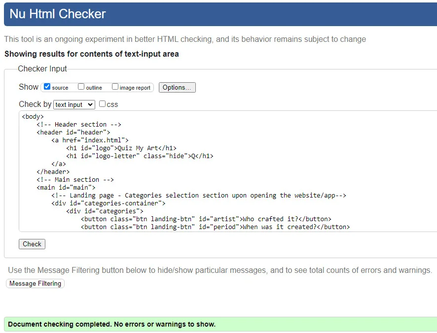.

**404 page**
- The initial run of 404 error html page returned an error in the aria-current attribute for h1 element.

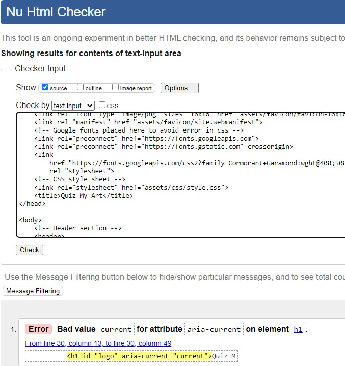.
	- I resolved this by adjusting the correct value to "page".
- The second error that was generated (image lost due to multiple corrections of the code) returned a semantic error indicating that a button element cannot be stored inside an anchor tag. 
	- I had several attempts to try and connect the button area to the main index.html file. At the end, I decided to keep the anchor tag and style it to look like a button. 

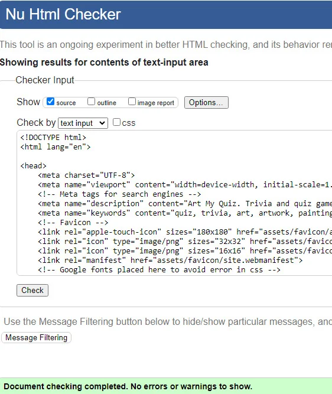.

**CSS**
- No errors were found when passing through the official W3C CSS validator. 

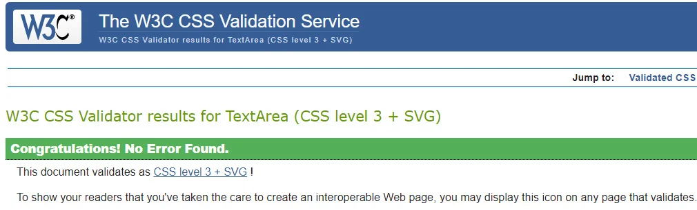.

[Return to Table of Contents](#contents)

### JS Hint Testing

All JavaScript pages were tested with JsHint services. Initial tests of the code returned the following warnings:

1) A couple of minor warnings of missing semicolons, which I corrected in the code subsequently (screenshot not taken).
2) A warning about three undefined variables which I have removed from the code (screenshot not taken).    
3) Three warnings of undefined variables.
    - This was generated because I have chosen to create three additional JavaScript files each containing an appropriate question list, i.e. artistQuestions, periodQuestions, and paintingQuestions.
    - The final screenshot of JSHint test run for the main script code: 
    
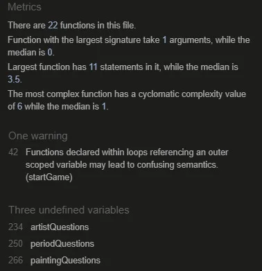

4) The test run for each category file returned a warning of three unused variables: artistQuestions, periodQuestions and paintingQuestions. 
    - As mentioned at point 3, this is due to the fact that I chose to create three separate JavaScript files that house each category of questions. All returned minor warnings.

Artist Questions test:

Period Questions test:

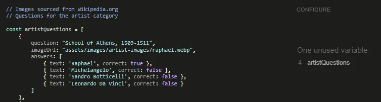

Painting Questions test:

[Return to Table of Contents](#contents)

### Bugs

**Website development and related issues**

When I started working on the project, my priority was to ensure that the quiz was fully functional. Therefore, I started working on JavaScript with a skeleton structure and a very basic design applied to the website. Once I was happy with how the website was working and that it was responding to button clicks correctly, I then shifted my focus to making it responsive and finally applying a color palette. 

Because I have chosen to manipulate the website mainly through the use of Ids and with a few classes, this has proven a challenge when working with CSS as the Ids were overriding each other. I had to tweak html code in order to ensure that I achieved the required responsiveness of the website. I also realised that my applied code in CSS (due to its hierarchical functioning) was overriding some of the website functionality. Therefore, I had to find ways to solve this without going back and changing the JavaScript code. 

I had to target a lot of individual elements and sections to ensure that I achieved the required responsiveness and design, in part because a lot of elements were generated/manipulated by JavaScript code, and some of them were overriding or overridden other parts of the code. This has resulted in a lengthy CSS file, which I have condensed and refactored as much as possible before it started affecting the visual display/responsiveness and functionality of the website.  

Below are just a couple of examples of the elements and sections that I had to target individually (some specificities are covered in the Fixed and Unfixed Bugs sections):
- I had to target the .btn class within the answer button section specifically because the functionality of correct/incorrect answers (set with Javascript) had changed since I started applying the color palette.
- In media queries, I had to target buttons and elements that are using/sharing .btn class specifically when setting the font size on larger devices because they did not respond to the change set against generic elements.

#### Fixed Bugs

**404-page error** 

When testing the 404 page, the console was throwing the following error in Dev Tools. 

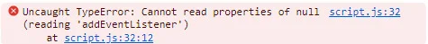

- This was caused by the next button event listener in the main JavaScript file, which was placed outside any function, making it of global scope. 
    - I resolved this by moving the event listener inside the function that was calling the next button.

**Jumping content in the main quiz area**

Once inside each category of the quiz, I noticed that the content was jumping on the smaller devices screen. This was due to several factors within the code that are noted below:
1. I decided to adjust the height of the main question container manually so that the display stays as consistent as possible. 
    - I am aware that this is not the most optimal solution to solve the problem. Therefore, this will be addressed at the next development stage. 

2. The image container kept changing dimensions (jumping) when different images were generated, i.e. moving between a landscape and a portrait image. 
    - I set a maximum/minimum width and height for the image container to ensure that all the images fit within the frame.
    - I used the "object-fit: contain;" on the image element to ensure that the image is not distorted or expands beyond the frame.  

3. The generated content inside the line just below the image display (id name "painting-name") is not consistent in length, which creates an additional line of text on smaller devices.
    - I resolved this by setting the exact height of the text container. 
        - I refrained from altering the width on smaller devices as it would have come out of the container bounds. 

4. The size of the answer buttons kept changing due to the generated content by JavaScript, which in turn made the content / page jump out of its place when the next button appeared. 
    - The content generated inside the answer choices' buttons is not consistent in length, which creates an additional line of text inside the buttons, hence the jump of the content. 
        - I resolved this by manually setting an exact height of the buttons and altering the height & width of it to suit the design / responsiveness of the website.

5. On larger devices, the content was jumping due to the set width of certain containers, i.e. container with "rules-description" id.
    - I resolved this by applying the width and height of the container based on the size of the screen.
    - The jumping of the content that was caused by the buttons was resolved once I applied flex-box to the button container. 
    - I was also able to keep the whole content of the website within the screen frame of larger devices.

**Responsiveness**

1. During the testing phase, I noticed that the layout of the website was distorted on larger devices. I adjusted the media queries based on most common device sizes, which seems to have resolved the majority of the issues, however, this has populated more code in the style.css file.

**Other inconsistencies**

1. Because the answer choice buttons were generated dynamically using JavaScript, they were not automatically picking up the font-family property from the body element in CSS file:
	- I had to apply the font-family property directly to the ".btn" class for it to take effect.

2. Due to limited space within the answer button container (especially on smaller devices), the answer buttons that have more content within them are more compact.  

#### Unfixed Bugs

1. Because I adjusted the height of the screen manually, it has distorted the original height of the screen. This has caused a scroll bar to appear on larger devices such as tablets and some desktops.
    - As mentioned in the Fixed bugs section, I am sure that there are more optimal ways of getting the content to stay in place, which I will be addressing at the next development stage.
    - I wanted to have the image container become larger, i.e. 500px width and 400px height, on larger devices to stay consistent with the design / accessibility. This has made the quiz content container / area larger, hence the scroll bar when testing on laptop / desktop screens.
        - This was a deliberate design choice to ensure that the image is clearly visible.
    - I will be addressing the height and container fit within the screen at the next development stage.

2.  On smaller devices, the distance between the next button and the footer is inconsistent. This is for a couple of reasons:
    1. Manually set height that prevents the content jumping (as mentioned in the Fixed Bugs section).
    2.  Each quiz generates different content that is of varying length. 
        - For example, the "When was it created?" quiz category generates a longer introductory paragraph which is [wrapped between three lines](assets/documentation/features-images/mobile/mobile-three-line-category.webp) on smaller devices. Similarly, the title / artist / work of art descriptions, and answer choices all have custom content that is of not one set length. 
        - All of these aspects have affected the overall height of the screen. I was unable to find a solution for  adjusting the height of each individual quiz category. Therefore, I chose to have one set height. 
        - I prioritised making the content static and having a consistent space between the answer buttons and the Next button ensuring a good user experience. 
    - I will be addressing all the mentioned bugs at the next development stage.

3. The content generated within the container below the image (id name "painting-name"), is not displayed consistently. I tried applying different padding and margin settings so that it would start from one exact point, but it did not fix the problem. The inconsistency, I believe, is due to different content lengths, which makes it impossible to set it in a way that it would ensure the text is displayed in the same position. An example image can be seen [here](assets/documentation/features-images/mobile/mobile-title-name-example.webp). 
    - This is something to address at the next development stage.

4. When testing the website for responsiveness, I noticed that the color palette changes once a device is set to dark mode. 
	- This design inconsistency was noticed towards the end of the testing phase and will be addressed at the next development stage.

5. The message below appears when running the 404 page via Chrome DevTools.

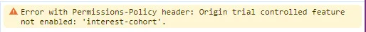
-  Upon further research into the matter, it appears that it is caused due to Github blocking data being gathered for FLoC. This does not affect the functionality of the website at all.
    - I found this information in GitHub community [discussion](https://github.com/orgs/community/discussions/52356).

[Return to Table of Contents](#contents)

### Lighthouse

#### The Home / landing page (one html page)

- **Desktop test score:**

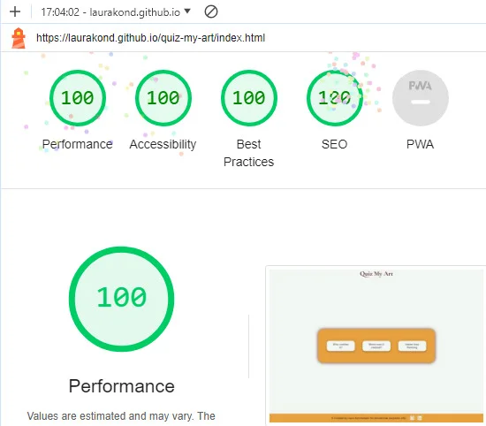

- **Mobile test score:**

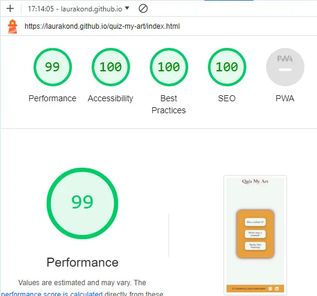

#### 404 page

- **Desktop test score:**

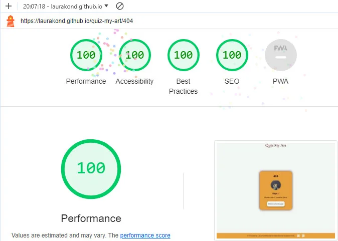

- **Mobile test score:**

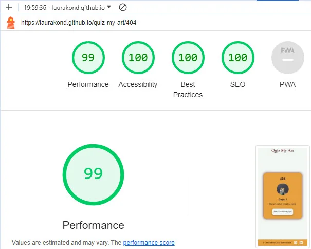

[Return to Table of Contents](#contents)

### User stories testing

| User Story                                                                                         | Completed | Action                              |
| -------------------------------------------------------------------------------------------------- | --------- | ----------------------------------- |
| As a first time user, I want to clearly understand how the quiz works and what it is about.        | Yes       |                                     |
| As a first time user, I want to be able to read instructions before the start of the quiz.         | Yes       | This has been implemented on a partial basis. Instead of creating a separate instructions section, they are displayed inside each category quiz. This is covered in the Features section in the main README file.                                    |
| As a first time user, I want to be able to start the quiz when I am ready.                         | Yes       |                                     |
| As a user, I want to test my art history knowledge by completing a quiz.                            | Yes       |                                     |
| As a user, I want to choose a category or difficulty of the quiz                                    | Yes       |                                     |
| As a user, I want to have multiple choice answers to pick from.                                   | Yes       |                                     |
| As a user, I want to see how many questions there are in total per round and which question I am at | Yes       |                                     |
| As a user, I want to instantly see if my choice was correct.                                        | Yes       |                                     |
| As a user, I want to find out my final score                                                        | Yes       |                                     |
| As a user, I want to be able to take the quiz again after the completion                            | Yes       |                                     |
| As a user, I want to have a variety of questions that do not repeat                                 | Yes       |                                     |
| As a user, I want to challenge myself by answering the questions without multiple choice options.   | No        | Moved to the next development phase 

[Return to Table of Contents](#contents)  

 
### Accessibility

I have followed good standard accessibility practices by including the following:
- I used semantic HTML.
- I included descriptive atl attributes to the used images. 
    - **To note**: as the quiz uses multiple images to generate questions, instead of providing a specific image description, I chose to name all the images as "Question Image". This prevents the players from getting a hint/answer to the question.
- I provided descriptive information for the screen readers where icons were used.
- I ensured that sufficient color contrast is provided when choosing the color palette. I used Contrast Grid website tool to ensure that the colors are well-chosen.

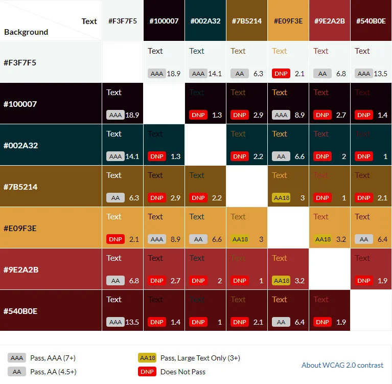

#### Wave report 

**The main page**
The three alerts are referring to what appears to be the question number count, the hidden score calculation and the total score count that is displayed at the end of each quiz.  

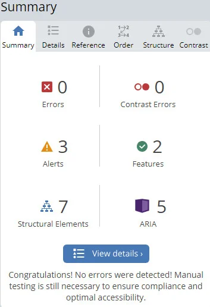

**The 404 page**
The shown alert refers to "redundant link: Adjacent links go to the same URL". Both anchor tags, one in the header and one in the main body refer to the index.html link. 

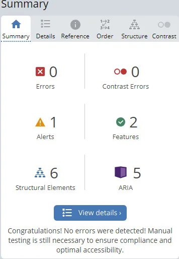

#### WCAG report
- The color contrast passes AAA standard but for the following exceptions:
	- the ridge border set around the image display color contrast returns a fail in all filters. The image showing this can be found [here](assets/documentation/testing-images/wcag-border.webp).
	- the answer buttons' and the footer's color contrasts return a fail against tritanopia filter. The image showing this can be found [here](assets/documentation/testing-images/wcag-tritanopia.webp).    

[Return to Table of Contents](#contents)

### Browser Testing
The website has been extensively tested using the following browsers and devices:
- [Google Chrome browser on desktop](assets/documentation/testing-images/device-screenshots/google-chrome.jpg), tablet (Samsung Galaxy tab 8) and mobile (iPhone7)

- [Mozilla Firefox browser](assets/documentation/testing-images/device-screenshots/firefox.jpg)
- [Internet Explorer browser](assets/documentation/testing-images/device-screenshots/explorer.jpg)
- [Safari browser on a mobile device](assets/documentation/testing-images/device-screenshots/safari-test.jpg):
    - iPhone 7 
	- iPhone 12 Pro Max
	- iPhone XS Max

- [Google Chrome Dev browser](assets/documentation/testing-images/device-screenshots/google-chrome-dev.jpg)
 
[Return to Table of Contents](#contents)

### Responsiveness Testing
I used Google Chrome Dev Tools and the [Resposive Design Checker](https://responsivedesignchecker.com/) for making sure that my website was fully responsive on various devices. 
-	Upon first check I had to go back and correct the code in order to ensure it is working correctly (see Bugs section in the main README.md).

[Return to Table of Contents](#contents)

### User Testing

#### During the Development 

I deployed the website as soon as possible and have been continuously testing throughout the development stage in order to fix any errors. It was also tested by numerous friends, and a handful of students from the Code Institute during the development stage. 
- No obvious functional (JavaScript) bugs or errors were present once the website has been completed.

#### Post Development

Once the website was completed, it was tested by numerous friends using different devices, such as mobiles, tablets/iPads, and desktops. 
-    No errors regarding the functionality of the website were noted.
-    There were some inconsistencies with how the website appeared on different devices, which I addressed at a later stage (see the [Fixed Bugs section](#fixed-bugs)).

[Return to Table of Contents](#contents)

### Manual Testing

Once the website was complete, I went through each page/feature, ensuring that it was working as intended.

| Feature                                                                          | Test performed                               | Expected outcome                                                                                                                                                                                                                                         | Pass/Fail |
| -------------------------------------------------------------------------------- | -------------------------------------------- | -------------------------------------------------------------------------------------------------------------------------------------------------------------------------------------------------------------------------------------------------------- | --------- |
| Navigation logo link                                                             | Click on logo                                | Redirects to home page.                                                                                                                                                                                                                                   | Pass      |
| Navigation button link to each quiz category                                     | Click on either category button              | Redirects to appropriate category quiz. An Event listener is trigerred and displays respective category's first question.                                                                                                                                | Pass      |
| Choose an answer from a given list of four options                               | Click on any answer button                   | An event listener for the button will trigger appropriate response, displaying the next button at the end. The mouse pointer functionality is disabled for any other buttons but the next button.                                                        | Pass      |
| Choose the correct answer                                                        | Click on an answer button                    | Enables style change in the button, displaying a green shadow border around the correct button. The mouse pointer functionality is disabled for any other buttons but the next button.                                                                   | Pass      |
| Choose the wrong answer                                                          | Click on any answer button                   | Enables style change in the button, displaying a red shadow border around the incorrect answer button and highlights the correct button with green shadow border. The mouse pointer functionality is disabled for any other buttons but the next button. | Pass      |
| Click on the next button to progress to the next question                        | Click on the next button                     | The question area is cleared and a new random question is generated enabling the question process to start again.                                                                                                                                        | Pass      |
| Proceed to the Score page                                                        | Click the next button ten times              | The question round is finished and automatically takes to the final score page. The total score and appropriate score text prompt is displayed.                                                                                                          | Pass      |
| Return to the Main Menu                                                          | Click on the play again button               | An Event listener for the play again button reloads the content and navigates the user to the main page where the three categories are displayed.                                                                                                        | Pass      |
| See Total score dispayed in the Score page                                       | Run the game                                 | The total score of correct answers will display at the end of the game. A hidden html element is triggered by JavaScript to keep count of all correct guesses made by the user.                                                                           | Pass      |
| See question number as the game progresses                                       | Run the game                                 | The question number is calculated by utilising JavaScript. The question count is displayed above the image as the game progresses.                                                                                                                       | Pass      |
| Different category name, questions and answers displayed based on game selection | Click on any category button                 | An Event Listener trigers appropriate category function within JavaScript that displays custom content to reflect each category. The question changes as the game progresses.                                                                            | Pass      |
| Different score prompts an appropriate score text from four possibilities        | Run the game and achieve varying score count | A customised score text will appear dependent on the total score. There are four possible outcomes.                                                                                                                                                       | Pass      |
| Error page                                                                       | Enter wrong url link                         | A 404 page will load if an incorrect url is typed in.                                                                                                                                                                                                    | Pass      |
| Return to Home page button in 404 page                                           | Click on the return to home page button      | An anchor tag is stylised to look like a button that has a src attribute set to the main html page which will take the user back to the main page.                                                                                                       | Pass      |
| Font Awesome icon to social media website - LinkedIn                             | Click on link                                | Redirected to LinkedIn page.                                                                                                                                                                                                                              | Pass      |
| Font Awesome icon to social media website - GitHub                               | Click on link                                | Redirected to GitHub page.                                                                                                                                                                                                                                | Pass      |
| Small mobile (up to 375px, 375px not included): Logo letter "Q" display          | Click on either category button              | Redirects to appropriate category quiz. An Event listener is trigerred and changes the display from "Quiz My Art" logo to letter "Q" once inside each category quiz.                                                                                     | Pass      |
| Small mobile (up to 375px, 375px not included): Full logo display                | Click on the next button                     | At the end of the quiz, the next button even listener is trigerred and takes to the final score page. The logo display returns to the full logo.                                                                                                         | Pass      |
| Devices up to 675px (675px not included): Header border shadow display           | Click on either category button              | Redirects to appropriate category quiz. An Event listener is trigerred and applies the border shadow style to the header once inside each category quiz.                                                                                                 | Pass      |
| Devices up to 675px (675px not included): Header border shadow display disabled  | Click on the next button                     | At the end of the quiz, the next button even listener is trigerred and takes to the final score page. The border shadow display to the header is reset to none.                                                                                          | Pass      |

[Return to Table of Contents](#contents)

[Return to the main README](README.md)